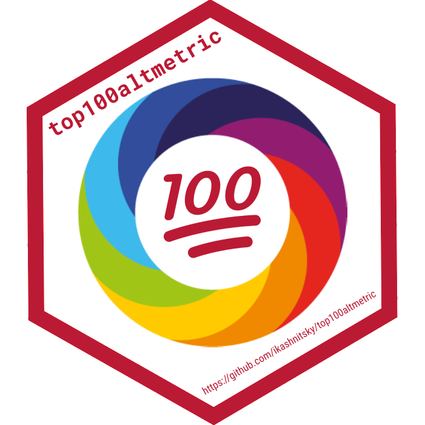

#   top100altmetric: yearly Altmetric top-100 data, ready for R

Top 100 noticed papers of the year according to Altmetric

Every year, 2013--2021, [Altmetric](https://www.altmetric.com) published the list of top 100 noticed papers. 

https://www.altmetric.com/top100/home/

The methodology of the list changed in 2020 -- due to the publication imbalances caused by COVID-19, the top-100 for 2020 in fact consists of 20 top-5 lists for research domains, more details in this [press release](https://www.altmetric.com/top100/2020/press-release.pdf). 2020 was the last year when Altmetric published its top-100 list, see [news here](https://www.altmetric.com/altmetric-news/re-imagining-the-top-100). 2021 list was published separately as part of the discussion around the changing methodology of the top-100 calculation, [see this blog post](https://www.altmetric.com/blog/top-100-2021-the-old-school-remix/).

# Source data files

2013 -- https://doi.org/10.6084/m9.figshare.5932729.v3  
2014 -- https://doi.org/10.6084/m9.figshare.7378310.v1  
2015 -- https://doi.org/10.6084/m9.figshare.1613288.v1  
2016 -- https://doi.org/10.6084/m9.figshare.4294073.v3  
2017 -- https://doi.org/10.6084/m9.figshare.5683957  
2018 -- https://doi.org/10.6084/m9.figshare.7441304.v1  
2019 -- https://doi.org/10.6084/m9.figshare.11371860.v3  
2020 -- https://doi.org/10.6084/m9.figshare.13607312.v2  
2021 -- https://doi.org/10.6084/m9.figshare.16974022.v1

# Altmetric score methodology

https://help.altmetric.com/support/solutions/articles/6000233311-how-is-the-altmetric-attention-score-calculated-
